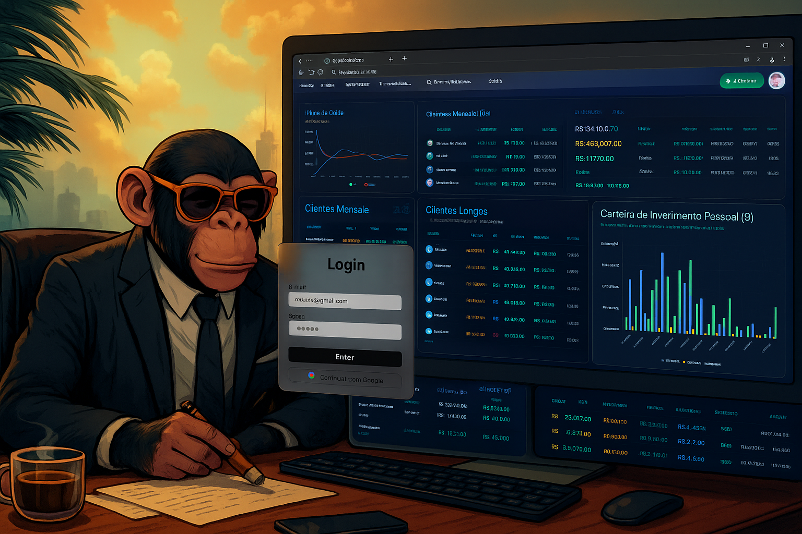

# 📊 SAS Clients — Gestão de Créditos e Investimentos Pessoais



SAS Clients é um **SaaS (Software as a Service)** desenvolvido em **Next.js 15** para facilitar o gerenciamento financeiro pessoal.  
Com ele, você pode controlar:

- **Créditos mensais**
- **Créditos de longo prazo**
- **Investimentos pessoais**
- **Fluxo de caixa**

O projeto utiliza **Supabase** como backend para autenticação, banco de dados e APIs, garantindo segurança e sincronização em tempo real.

---

## 🚀 Tecnologias Utilizadas

- **Next.js 15 (App Router)**
- **React + TypeScript**
- **Supabase (Auth + Database)**
- **Tailwind CSS**
- **ShadCN/UI**
- **Vercel (Deploy recomendado)**

---

## ⚙️ Variáveis de Ambiente

Crie um arquivo `.env.local` na raiz do projeto e adicione as variáveis do **Supabase**:

```env
NEXT_PUBLIC_SUPABASE_URL=
NEXT_PUBLIC_SUPABASE_ANON_KEY=
